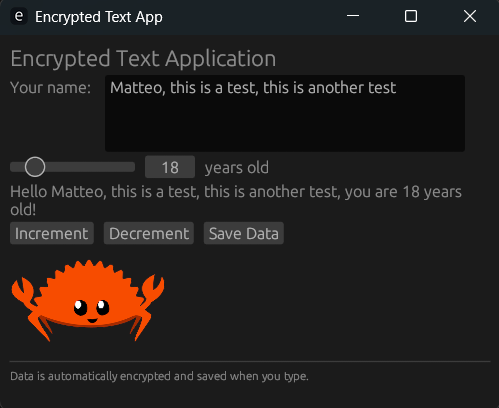
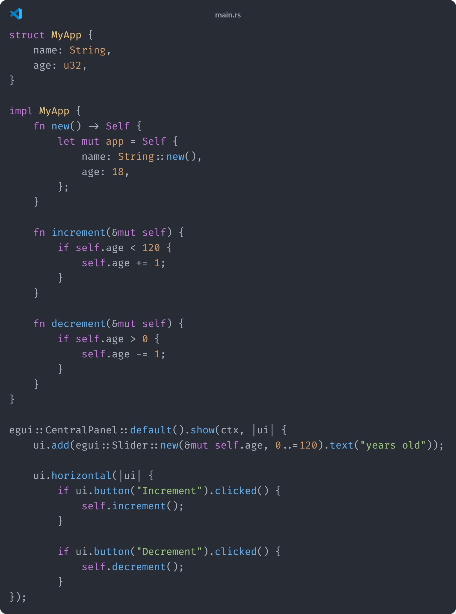
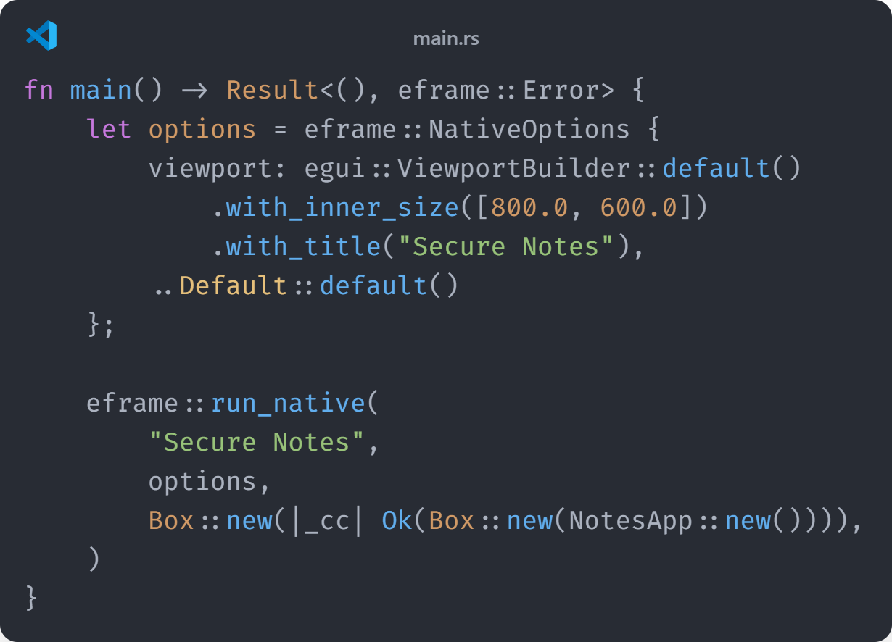
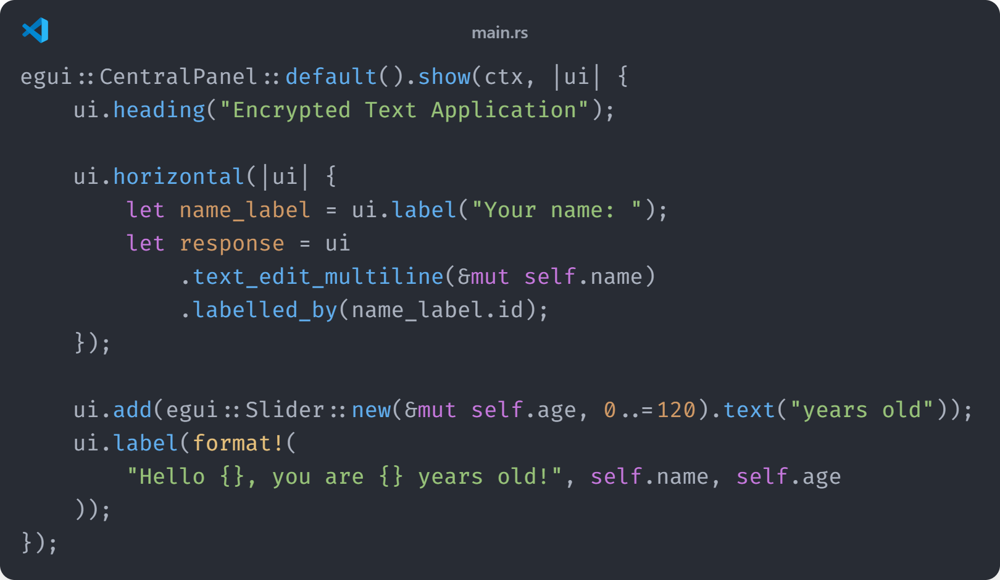

\tableofcontents

\newpage

# Versioning

| Version | Date       | Time  | Updates                                                      | Author          |
| ------- | ---------- | ----- | ------------------------------------------------------------ | --------------- |
| 1.0.0   | 03.06.2025 | 13:06 | Started Documentation                                        | Matteo Cipriani |
| 1.1.0   | 03.06.2025 | 14:27 | Started Introduction                                         | Matteo Cipriani |
| 1.2.0   | 03.06.2025 | 15:08 | Started Listing Sources                                      | Matteo Cipriani |
| 1.3.0   | 03.06.2025 | 17:11 | Added Planned Schedule                                       | Matteo Cipriani |
| 1.4.0   | 04.06.2025 | 10:22 | Added Decision Matrix, Dailies 1 & 2, Described egui testing | Matteo Cipriani |

\newpage

# Introduction

## Task Definition

At the end of the year, each apprentice who worked in the ZLI is required to do a project of their own choosing. They have to plan, execute and document an appropriate project over the span of 4 weeks, while working Monday - Wednesday (or Wednesday - Friday, depending on their school days). With this project, the apprentices can demonstrate what they have learned from the coaches during the last year, as all competences required to fulfill the project have been topics during this past year, some have been used very frequently, while others have only been discussed during 1 week.

## Project Description

I chose to create a Notes App using Rust. I initially wanted to make a To-Do App, but as I have already done a To-Do App using Dart & Flutter as my Sportferienprojekt, I chose to go with something different. I want to try to write this project purely in Rust, to see how much of the language I have learned during the last year, and I can definitely learn new things from this project too. Because Rust is quite famous for being a really safe programming language, I want to try and implement one or two ways to encrypt and store the data safely.

## Known Risks

I know that creating an application purely in Rust might be difficult, especially because Rust isn't really made to design, but to work. To implement a GUI, you have to use crates, which are known to sometimes be even more difficult than the standard Rust syntax itself. And Rust itself has a pretty steep learning curve too. Managing lifetimes, references, and borrowing can be complex, especially with dynamically changing data like note content. On top of that, Rust's error system (e.g., `Result` and `Option`) is safe but verbose, requiring you to explicitly handle many cases.

\newpage

# Planning

## Schedule

## Decision Matrix

### Basic Functionality Components (MS 2)

\begin{longtable}[]{@{}p{3cm}p{4cm}p{8cm}@{}}
\toprule
\textbf{Feature} & \textbf{Recommended Crates} & \textbf{Implementation Suggestions} \\
\midrule
\endhead
\bottomrule
\endlastfoot

\rowcolor{lightgray}
\textbf{Password Verification} &
\texttt{argon2}, \texttt{bcrypt}, or \texttt{pbkdf2} &
Use Argon2id for password hashing - it's modern and secure. Store the hash in a config file using \texttt{confy} or \texttt{config}. For verification, use the crate's verify function to compare entered password against stored hash. \\

\textbf{GUI Framework} &
\texttt{egui}, \texttt{iced}, or \texttt{druid} &
\texttt{egui} is lightweight and easy to use for beginners. \texttt{iced} offers a more Elm-like architecture. Both have good documentation and active communities. \\

\rowcolor{lightgray}
\textbf{Note Struct} &
\texttt{serde}, \texttt{chrono}, \texttt{uuid} &
Use \texttt{chrono} for timestamps, \texttt{uuid} for unique IDs, and \texttt{serde} with the \texttt{derive} feature for serialization. Consider implementing \texttt{Display} and \texttt{Debug} traits. \\

\textbf{Note Encryption} &
\texttt{aes-gcm}, \texttt{chacha20poly1305}, \texttt{orion} &
ChaCha20-Poly1305 is modern and fast on all platforms. Use \texttt{ring} or \texttt{orion} for key derivation from password (PBKDF2 or Argon2). Store a random salt with each note. \\

\rowcolor{lightgray}
\textbf{File Storage} &
\texttt{serde\_json}, \texttt{bincode}, \texttt{postcard} &
\texttt{bincode} for efficient binary serialization or \texttt{serde\_json} for human-readable storage. Use \texttt{directories-next} to find appropriate app data directory. \\

\textbf{Loading Notes} &
Same as above + \texttt{anyhow} &
Use \texttt{anyhow} or \texttt{thiserror} for error handling during file operations. Consider lazy loading for large note collections. \\

\rowcolor{lightgray}
\textbf{Note Viewing} &
GUI framework &
Implement a split view with note list on left and content on right. Use virtual list if you expect many notes. \\

\textbf{Deleting Notes} &
GUI framework + \texttt{confirm\_dialog} &
Use context menus from your GUI framework. Consider soft deletion (marking as deleted) before permanent removal. \\

\rowcolor{lightgray}
\textbf{Session Persistence} &
\texttt{keyring}, \texttt{directories-next} &
Store an encrypted token in the system keyring or in a hidden file in the app directory. Use \texttt{directories-next} to find appropriate locations. \\

\end{longtable}

### Finalization & Polish Components (MS 3)

\begin{longtable}[]{@{}p{3cm}p{4cm}p{8cm}@{}}
\toprule
\textbf{Feature} & \textbf{Recommended Crates} & \textbf{Implementation Suggestions} \\
\midrule
\endhead
\bottomrule
\endlastfoot

\rowcolor{lightgray}
\textbf{Error Handling} &
\texttt{thiserror}, \texttt{anyhow}, \texttt{log} &
Define custom error types with \texttt{thiserror}. Use \texttt{log} with \texttt{env\_logger} or \texttt{fern} for logging. Show user-friendly messages in UI while logging details. \\

\textbf{GUI Styling} &
GUI framework theming &
Most Rust GUI frameworks support theming. Use system colors or implement dark/light mode toggle. Consider accessibility (contrast, font sizes). \\

\rowcolor{lightgray}
\textbf{Timestamps} &
\texttt{chrono}, \texttt{time} &
Store UTC timestamps internally, convert to local time for display. Format with \texttt{chrono}'s formatting options. \\

\textbf{Note Sorting} &
Standard library &
Use Rust's built-in sorting with custom comparators. Consider allowing multiple sort options (recent, alphabetical). \\

\rowcolor{lightgray}
\textbf{Plain Text Export} &
\texttt{std::fs}, GUI file dialog &
Use native file dialogs from your GUI framework. Consider supporting multiple formats (txt, md, html). \\

\textbf{Settings Page} &
GUI framework, \texttt{confy} &
Store settings with \texttt{confy} which handles serialization. Create a modal dialog or separate tab for settings. \\

\rowcolor{lightgray}
\textbf{Windows Executable} &
\texttt{cargo-wix}, \texttt{cargo-bundle} &
Use GitHub Actions for CI/CD to automate builds. Test on Windows VM before release. \\

\textbf{App Packaging} &
\texttt{cargo-wix}, \texttt{cargo-bundle} &
Create an installer with \texttt{cargo-wix} for Windows. Include a nice icon and proper metadata. \\

\rowcolor{lightgray}
\textbf{Documentation} &
\texttt{mdbook} &
Write user docs in Markdown, possibly generate with \texttt{mdbook}. Include screenshots and keyboard shortcuts. \\

\textbf{Keyboard Shortcuts} &
GUI framework &
Most GUI frameworks have built-in shortcut handling. Map to actions using a configuration struct. \\

\end{longtable}

\newpage

# Main Content

## Procedure and steps

### Testing with `egui`

After reading up on a bit of the documentation, I tried to copy a simple "tutorial" app that is just a input field for a name and a slider for the age. Once I was done copying all the code and successfully ran the program for the first time, I tried to figure out how I can access variables that I referenced when initiating the app's components. I also played around with function calls, and where it is best to place them.

### Encrypting and saving

During my experiments with `egui` and other crates that I'd use later in the project, I initially went for an approach that encrypts the notes in an unusual way:

1. Key Derivation:
    A random 16-byte salt is generated. Using Argon2id, a secure 32-byte key is derived from the user's password and the salt.
2. Encryption:
    A random 12-byte nonce is created. The plaintext data is encrypted using AES-256-GCM with the derived key and nonce, producing ciphertext and an authentication tag.
3. Metadata Attachment
    The salt, Argon2 password hash (as UTF-8), nonce, and ciphertext are bundled together along with structured metadata (e.g., as a JSON `EncryptedData` object).
4. Obfuscation and Finalization
   - A fake 'SQLite format 3' header is prepended.
   - A Unix timestamp (8 bytes) and 48 bytes of random padding are appended.
   - A SHA-256 checksum of the entire content is added for integrity.

## Results

## Function Descriptions

## Work journal

## Test plan

\newpage

# Dailies

## Day 1: 02.06.2025

On the first day, I first ran my idea by Reto really quickly, just to confirm wether I could do a project like this. After all, I didn't want to plan my project for the next few hours just for it to get turned down by him. After his confirmation, I began planning my project, utilizing GitHub Projects, just like I've already done for my other project that I realized while in the ZLI. Shortly after the lunch break, I presented my idea in a more detailed manner - every milestone and a few distinct goals that I wanted to reach. After getting the project signed off by Reto, I was able to begin my research on what I would actually need / use for this app. Very quickly, I found out about `egui` and `eframe`, which are 2 incredibly well documented crates that make it manageable to create a GUI for your app. As for safety, I chose to go with `argon2` for the password verification, while I decided to try out `chacha20poly1305` combined with `ring` or `orion` for the note encryption itself. I actually already got to test a bit with egui, where I tried to copy a basic application with name and age, that shows you how `egui` works and what is to expect when working with it.

## Day 2: 03.06.2025

Day 2 was mainly focussed on the documentation, as I knew from my last project, that it would get incredibly difficult to write a good documentation just during the last week, as you forgot a lot of things already. I didn't want to create a documentation with Word, as I had quite a few problems with it the last time I tried it, so I did some research into Markdown-Documentations enhanced with LaTeX and found out, that it is actually a viable alternative to create your documentation with. While the installation of all the things I needed (or I needed to update) took quite some time, I think that I'll get that time back by not having to wrestle with the layout on each page every time I try to insert a picture. In the afternoon, I first began by describing the project's guidelines, my project description and the risks I knew about before beginning my project. I then added the list of sources that I have already used. To finish off the day, I created a Gantt Diagram for my planned schedule and am now keeping track of when I actually worked on the tasks so I can compare to my plan at the end of the project.

## Day 3: 04.06.2025

\newpage

# Appendix

## Sources

- [docs.rs](https://www.docs.rs)
  - Basic Documentation for all of the crates used
  - Further linking to official websites / GitHub repositories with official examples / code snippets
  - Structs, Enums, Functions, Models & Type Aliases for each crate (if available)
- [GitHub](https://www.github.com)
  - Extensive Documentation about crates
  - Function snippets
  - Implementation Methods
- [Rust's official website](https://www.rust-lang.org/)
  - Basic Questions about Rust's functionality
  - Further linking to community boards
- [THE Rust Book](https://doc.rust-lang.org/book/)
  - Basic Introduction to Rust
  - Easy explanations for some more complicated topics of Rust
- [Rust By Example](https://doc.rust-lang.org/rust-by-example/)
  - Examples for some crucial features
    - Examples are editable & executable
  - Good "playground"
- [The Cargo Book](https://doc.rust-lang.org/cargo/guide/)
  - Guide through Rust's package manager
  - Easy point to access Features, Commands and general infos about cargo

## Glossary

### Checksum

A small-sized hash or value used to verify the integrity of data. It ensures that data has not been tampered with or corrupted during storage or transmission.

### CI/CD

Stands for Continuous Integration and Continuous Deployment/Delivery. In the context of a Rust secure notes app, CI/CD automates testing, building, and deploying updates to ensure code reliability and fast delivery.

### Ciphertext

The encrypted form of data that cannot be read without decryption. In the app, notes are converted to ciphertext using an encryption key before being stored on disk.

### Hash

A deterministic output of a hash function, producing a fixed-size value from arbitrary input. Hashes are used for verifying integrity, storing passwords securely, and comparing data without revealing the original input.

### Key Derivation

A cryptographic process that generates a strong encryption key from a password or passphrase. Typically used with algorithms like PBKDF2, Argon2, or scrypt to protect against brute-force attacks.

### Lightweight

Describes a program or library with minimal resource usage (e.g., memory, CPU). A lightweight secure notes app in Rust would be fast, efficient, and suitable for low-power or embedded environments.

### Nonce

A "number used once" in cryptography to ensure that encryption results are unique each time. Used in encryption schemes like AES-GCM to prevent replay attacks and ensure data security.

### Password Hashing

The process of converting a password into a fixed-size string (hash) using a cryptographic hash function. In a secure notes app, this is used to securely store and verify user passwords without keeping them in plain text.

### Salt

A random value added to passwords before hashing to ensure unique hashes for identical passwords. This prevents precomputed hash attacks (e.g., rainbow tables).

### Serialization

The process of converting data structures (e.g., Rust structs) into a format that can be stored or transmitted, such as JSON, TOML, or binary. Used in the app to save and load notes securely.

### System Keyring

A secure storage mechanism provided by the operating system for storing secrets such as passwords or keys. The secure notes app can optionally use the system keyring to store encryption keys safely.

\newpage

## Code Snippets

