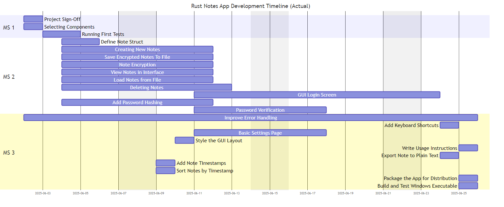
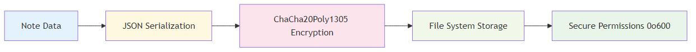
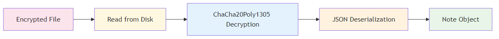

\tableofcontents

\newpage

# Versioning

| Version | Date       | Time  | Updates                                           | Author          |
| ------- | ---------- | ----- | ------------------------------------------------- | --------------- |
| v0.1.0  | 03.06.2025 | 13:06 | Started Documentation                             | Matteo Cipriani |
| v0.1.1  | 03.06.2025 | 14:27 | Started Introduction                              | Matteo Cipriani |
| v0.1.2  | 03.06.2025 | 15:08 | Started Listing Sources                           | Matteo Cipriani |
| v0.2.0  | 03.06.2025 | 17:11 | Revamped Components Cable to be of LaTeX-style    | Matteo Cipriani |
| v0.3.0  | 04.06.2025 | 10:22 | Added Decision Matrix                             | Matteo Cipriani |
| v0.3.1  | 04.06.2025 | 10:24 | Added Dailies Section                             | Matteo Cipriani |
| v0.3.2  | 04.06.2025 | 11:02 | Added Dailies 1 & 2                               | Matteo Cipriani |
| v0.4.0  | 04.06.2025 | 11:37 | Described egui Testing                            | Matteo Cipriani |
| v0.4.1  | 10.06.2025 | 09:34 | Added Daily 3                                     | Matteo Cipriani |
| v0.5.0  | 10.06.2025 | 11:18 | Rough Description of Security Features            | Matteo Cipriani |
| v0.5.1  | 10.06.2025 | 13:17 | Refactored Descriptions                           | Matteo Cipriani |
| v0.6.0  | 10.06.2025 | 13:35 | Initialized Glossary                              | Matteo Cipriani |
| v0.6.1  | 10.06.2025 | 14:52 | Entered First Entries into Glossary               | Matteo Cipriani |
| v0.7.0  | 10.06.2025 | 15:22 | Began Gantt for Planned Schedule                  | Matteo Cipriani |
| v0.7.1  | 10.06.2025 | 16:40 | Changed Gantt from SVG to PNG                     | Matteo Cipriani |
| v0.7.2  | 11.06.2025 | 09:01 | Added Daily 4                                     | Matteo Cipriani |
| v0.7.3  | 11.06.2025 | 16:35 | Added Daily 5                                     | Matteo Cipriani |
| v0.8.0  | 16.06.2025 | 13:51 | Redesigned Glossary                               | Matteo Cipriani |
| v0.8.1  | 16.06.2025 | 16:24 | Added Daily 6                                     | Matteo Cipriani |
| v0.8.2  | 17.06.2025 | 14:29 | Extended Glossary with new words                  | Matteo Cipriani |
| v0.8.3  | 17.06.2025 | 15:31 | Redesigned versioning table                       | Matteo Cipriani |
| v0.8.4  | 18.06.2025 | 08:12 | Added Daily 7                                     | Matteo Cipriani |
| v0.8.5  | 18.06.2025 | 17:46 | Added Daily 8                                     | Matteo Cipriani |
| v0.8.6  | 20.06.2025 | 17:27 | Added Daily 9                                     | Matteo Cipriani |
| v0.9.0  | 23.06.2025 | 15:18 | Added extensive description of encryption process | Matteo Cipriani |
| v0.10.0 | 23.06.2025 | 17:03 | Added Function Descriptions                       | Matteo Cipriani |
| v0.10.1 | 24.06.2025 | 15:36 | Added Daily 10                                    | Matteo Cipriani |
| v0.11.0 | 24.06.2025 | 16:55 | Updated Glossary                                  | Matteo Cipriani |
| v0.11.1 | 24.06.2025 | 17:13 | Added Daily 11                                    | Matteo Cipriani |
| v0.12.0 | 25.06.2025 | 09:18 | Added Test Protocol                               | Matteo Cipriani |
| v0.13.0 | 25.06.2025 | 17:24 | Added Images from Results                         | Matteo Cipriani |
| v0.13.1 | 25.06.2025 | 17:39 | Added Daily 12                                    | Matteo Cipriani |
| v1.0.0  | 25.06.2025 | 17:40 | Finished Documentation                            | Matteo Cipriani |

\newpage

# Introduction

## Task Definition

At the end of the year, each apprentice who worked in the ZLI is required to do a project of their own choosing. They have to plan, execute and document an appropriate project over the span of 4 weeks, while working Monday - Wednesday (or Wednesday - Friday, depending on their school days). With this project, the apprentices can demonstrate what they have learned from the coaches during the last year, as all competences required to fulfill the project have been topics during this past year, some have been used very frequently, while others have only been discussed during 1 week.

## Project Description

I chose to create a Notes App using Rust. I initially wanted to make a To-Do App, but as I have already done a To-Do App using Dart & Flutter as my Sportferienprojekt, I chose to go with something different. I want to try to write this project purely in Rust, to see how much of the language I have learned during the last year, and I can definitely learn new things from this project too. Because Rust is quite famous for being a really safe programming language, I want to try and implement one or two ways to encrypt and store the data safely.

## Known Risks

I know that creating an application purely in Rust might be difficult, especially because Rust isn't really made to design, but to work. To implement a GUI, you have to use crates, which are known to sometimes be even more difficult than the standard Rust syntax itself. And Rust itself has a pretty steep learning curve too. Managing lifetimes, references, and borrowing can be complex, especially with dynamically changing data like note content. On top of that, Rust's error system (e.g., `Result` and `Option`) is safe but verbose, requiring you to explicitly handle many cases.

\newpage

# Planning

## Schedule




\newpage

## Decision Matrix

### Basic Functionality Components (MS 2)

\begin{longtable}[]{@{}p{3cm}p{4cm}p{8cm}@{}}
\toprule
\textbf{Feature} & \textbf{Recommended Crates} & \textbf{Implementation Suggestions} \\
\midrule
\endhead
\bottomrule
\endlastfoot

\rowcolor{lightgray}
\textbf{Password Verification} &
\texttt{argon2}, \texttt{bcrypt}, or \texttt{pbkdf2} &
Use Argon2id for password hashing - it's modern and secure. Store the hash in a config file using \texttt{confy} or \texttt{config}. For verification, use the crate's verify function to compare entered password against stored hash. \\

\textbf{GUI Framework} &
\texttt{egui}, \texttt{iced}, or \texttt{druid} &
\texttt{egui} is lightweight and easy to use for beginners. \texttt{iced} offers a more Elm-like architecture. Both have good documentation and active communities. \\

\rowcolor{lightgray}
\textbf{Note Struct} &
\texttt{serde}, \texttt{chrono}, \texttt{uuid} &
Use \texttt{chrono} for timestamps, \texttt{uuid} for unique IDs, and \texttt{serde} with the \texttt{derive} feature for serialization. Consider implementing \texttt{Display} and \texttt{Debug} traits. \\

\textbf{Note Encryption} &
\texttt{aes-gcm}, \texttt{chacha20poly1305}, \texttt{orion} &
ChaCha20-Poly1305 is modern and fast on all platforms. Use \texttt{ring} or \texttt{orion} for key derivation from password (PBKDF2 or Argon2). Store a random salt with each note. \\

\rowcolor{lightgray}
\textbf{File Storage} &
\texttt{serde\_json}, \texttt{bincode}, \texttt{postcard} &
\texttt{bincode} for efficient binary serialization or \texttt{serde\_json} for human-readable storage. Use \texttt{directories-next} to find appropriate app data directory. \\

\textbf{Loading Notes} &
Same as above + \texttt{anyhow} &
Use \texttt{anyhow} or \texttt{thiserror} for error handling during file operations. Consider lazy loading for large note collections. \\

\rowcolor{lightgray}
\textbf{Note Viewing} &
GUI framework &
Implement a split view with note list on left and content on right. Use virtual list if you expect many notes. \\

\textbf{Deleting Notes} &
GUI framework + \texttt{confirm\_dialog} &
Use context menus from your GUI framework. Consider soft deletion (marking as deleted) before permanent removal. \\

\rowcolor{lightgray}
\textbf{Session Persistence} &
\texttt{keyring}, \texttt{directories-next} &
Store an encrypted token in the system keyring or in a hidden file in the app directory. Use \texttt{directories-next} to find appropriate locations. \\

\end{longtable}

\newpage

### Finalization & Polish Components (MS 3)

\begin{longtable}[]{@{}p{3cm}p{4cm}p{8cm}@{}}
\toprule
\textbf{Feature} & \textbf{Recommended Crates} & \textbf{Implementation Suggestions} \\
\midrule
\endhead
\bottomrule
\endlastfoot

\rowcolor{lightgray}
\textbf{Error Handling} &
\texttt{thiserror}, \texttt{anyhow}, \texttt{log} &
Define custom error types with \texttt{thiserror}. Use \texttt{log} with \texttt{env\_logger} or \texttt{fern} for logging. Show user-friendly messages in UI while logging details. \\

\textbf{GUI Styling} &
GUI framework theming &
Most Rust GUI frameworks support theming. Use system colors or implement dark/light mode toggle. Consider accessibility (contrast, font sizes). \\

\rowcolor{lightgray}
\textbf{Timestamps} &
\texttt{chrono}, \texttt{time} &
Store UTC timestamps internally, convert to local time for display. Format with \texttt{chrono}'s formatting options. \\

\textbf{Note Sorting} &
Standard library &
Use Rust's built-in sorting with custom comparators. Consider allowing multiple sort options (recent, alphabetical). \\

\rowcolor{lightgray}
\textbf{Plain Text Export} &
\texttt{std::fs}, GUI file dialog &
Use native file dialogs from your GUI framework. Consider supporting multiple formats (txt, md, html). \\

\textbf{Settings Page} &
GUI framework, \texttt{confy} &
Store settings with \texttt{confy} which handles serialization. Create a modal dialog or separate tab for settings. \\

\rowcolor{lightgray}
\textbf{Windows Executable} &
\texttt{cargo-wix}, \texttt{cargo-bundle} &
Use GitHub Actions for CI/CD to automate builds. Test on Windows VM before release. \\

\textbf{App Packaging} &
\texttt{cargo-wix}, \texttt{cargo-bundle} &
Create an installer with \texttt{cargo-wix} for Windows. Include a nice icon and proper metadata. \\

\rowcolor{lightgray}
\textbf{Documentation} &
\texttt{mdbook} &
Write user docs in Markdown, possibly generate with \texttt{mdbook}. Include screenshots and keyboard shortcuts. \\

\textbf{Keyboard Shortcuts} &
GUI framework &
Most GUI frameworks have built-in shortcut handling. Map to actions using a configuration struct. \\

\end{longtable}

\newpage

# Main Content

## Procedure and steps

### Testing with `egui`

After reading up on a bit of the documentation, I tried to copy a simple "tutorial" app that is just a input field for a name and a slider for the age. Once I was done copying all the code and successfully ran the program for the first time, I tried to figure out how I can access variables that I referenced when initiating the app's components. I also played around with function calls, and where it is best to place them.

### Encrypting and saving

During my experiments with `egui` and other crates that I'd use later in the project, I initially went for an approach that encrypts the notes in an unusual way:

1. Key Derivation:
    A random 16-byte salt is generated. Using Argon2id, a secure 32-byte key is derived from the user's password and the salt.
2. Encryption:
    A random 12-byte nonce is created. The plaintext data is encrypted using AES-256-GCM with the derived key and nonce, producing ciphertext and an authentication tag.
3. Metadata Attachment
    The salt, Argon2 password hash (as UTF-8), nonce, and ciphertext are bundled together along with structured metadata (e.g., as a JSON `EncryptedData` object).
4. Obfuscation and Finalization
   - A fake 'SQLite format 3' header is prepended.
   - A Unix timestamp (8 bytes) and 48 bytes of random padding are appended.
   - A SHA-256 checksum of the entire content is added for integrity.

In the actual project, the encryption process looks a little more like this:

#### Hardware Fingerprinting

The system creates a stable hardware fingerprint using:

```rust
// Components used for hardware fingerprinting
let mut components = Vec::new();
components.push(format!("user:{}", username));           // Username
components.push(format!("home:{}", home_dir));           // Home directory
components.push(format!("os:{}", env::consts::OS));      // Operating system
components.push(format!("arch:{}", env::consts::ARCH));  // Architecture
components.push(format!("computer:{}", computer_name));  // Computer name
```

#### Password-Based Key Derivation (Argon2id)

```rust
// Production-grade Argon2 parameters
let memory_cost = 131072;  // 128 MB memory usage
let iterations = 3;        // 3 iterations
let parallelism = 4;       // 4 parallel threads

// Key derivation takes ~5-10 seconds intentionally
let params = argon2::Params::new(memory_cost, iterations, parallelism, Some(32));
let argon2 = Argon2::new(argon2::Algorithm::Argon2id, argon2::Version::V0x13, params);
```

\newpage

#### Hardware-Bound Salt Generation

```rust
fn generate_hardware_salt(&self) -> [u8; 32] {
    let hardware_hash = self.generate_stable_hardware_fingerprint();
    let hash_bytes = hardware_hash.to_le_bytes();

    // Create deterministic salt from hardware fingerprint
    for i in 0..32 {
        let factor = (i as u8).wrapping_mul(17);
        salt[i] = hash_bytes[i % 8] ^ factor ^ 0xAA;
    }
}
```

#### Encryption Implementation

##### Cipher: ChaCha20Poly1305 AEAD

- **Algorithm**: ChaCha20 stream cipher + Poly1305 MAC
- **Key Size**: 256 bits (32 bytes)
- **Nonce Size**: 96 bits (12 bytes)
- **Authentication**: Built-in message authentication

##### Encryption Process

```rust
pub fn encrypt(&self, data: &[u8]) -> Result<Vec<u8>> {
    let cipher = self.cipher.as_ref().ok_or("Cipher not initialized")?;

    // Generate random nonce for each encryption
    let nonce = ChaCha20Poly1305::generate_nonce(&mut OsRng);

    // Encrypt data with authentication
    let ciphertext = cipher.encrypt(&nonce, data)?;

    // Prepend nonce to ciphertext
    let mut result = Vec::new();
    result.extend_from_slice(&nonce);      // First 12 bytes: nonce
    result.extend_from_slice(&ciphertext); // Remaining: encrypted data + auth tag
    Ok(result)
}
```

##### Decryption Process

```rust
pub fn decrypt(&self, data: &[u8]) -> Result<Vec<u8>> {
    if data.len() < 12 {
        return Err(anyhow!("Invalid encrypted data"));
    }

    // Split nonce and ciphertext
    let (nonce_bytes, ciphertext) = data.split_at(12);
    let nonce = Nonce::from_slice(nonce_bytes);

    // Decrypt and verify authentication
    let plaintext = cipher.decrypt(nonce, ciphertext)?;
    Ok(plaintext)
}
```

\newpage

#### Data Flow \

\






#### Security Features

##### Hardware Binding

```rust
// Security check on each login
let (current_hash, current_components) = self.generate_stable_hardware_fingerprint()?;

if metadata.hardware_fingerprint_hash != current_hash {
    // Detect hardware changes
    return Err(anyhow!("Hardware fingerprint changed"));
}
```

##### Security Metadata

```rust
struct SecurityMetadata {
    version: u32,                           // Encryption version
    created_timestamp: u64,                 // Account creation time
    hardware_fingerprint_hash: u64,         // Hardware binding hash
    hardware_components: Vec<String>,       // Detailed hardware info
}
```

##### File Security

```rust
#[cfg(unix)]
fn secure_file_permissions(&self, file_path: &Path) -> Result<()> {
    let mut perms = fs::metadata(file_path)?.permissions();
    perms.set_mode(0o600); // Owner read/write only
    fs::set_permissions(file_path, perms)?;
}
```

##### User Isolation

```plaintext
~/.config/secure_notes/
├── users.json                    # User database (hashed passwords)
└── users/
    ├── user1-uuid/
    │   ├── notes.enc             # Encrypted notes
    │   ├── auth.hash             # Password verification hash
    │   └── security.meta         # Security metadata
    └── user2-uuid/
        ├── notes.enc
        ├── auth.hash
        └── security.meta
```

#### Security Properties

| Property             | Implementation               | Benefit                           |
| -------------------- | ---------------------------- | --------------------------------- |
| **Confidentiality**  | ChaCha20 encryption          | Data unreadable without key       |
| **Integrity**        | Poly1305 authentication      | Detects tampering                 |
| **Authentication**   | Argon2 password hashing      | Prevents unauthorized access      |
| **Hardware Binding** | Fingerprint-based salt       | Prevents key extraction           |
| **Forward Secrecy**  | Random nonces per encryption | Past data safe if key compromised |
| **User Isolation**   | Per-user encryption keys     | No cross-user data access         |

#### Key Security Parameters

```rust
// Argon2id Configuration (Production Grade)
memory_cost: 131072,    // 128 MB - Prevents memory-hard attacks
iterations: 3,          // 3 rounds - Balances security/performance
parallelism: 4,         // 4 threads - Utilizes modern CPUs
output_length: 32,      // 256-bit key - Industry standard

// ChaCha20Poly1305 Configuration
key_size: 32,          // 256-bit key
nonce_size: 12,        // 96-bit nonce (never reused)
auth_tag_size: 16,     // 128-bit authentication tag
```

\newpage

#### Critical Security Checks

##### Hardware Change Detection

```rust
fn is_critical_hardware_change(&self, stored: &[String], current: &[String]) -> bool {
    // Only fail on critical component changes
    let stored_critical: Vec<_> = stored.iter()
        .filter(|c| c.starts_with("user:") || c.starts_with("os:") || c.starts_with("arch:"))
        .collect();

    let current_critical: Vec<_> = current.iter()
        .filter(|c| c.starts_with("user:") || c.starts_with("os:") || c.starts_with("arch:"))
        .collect();

    stored_critical != current_critical
}
```

This encryption system provides **military-grade security** while maintaining usability through automatic key management and hardware binding, ensuring that encrypted notes remain secure even if the application files are compromised.

\newpage

## Function Descriptions

### `CryptoManager::initialize_for_user()`

- **Reference:** Code Snippet No. 4
- **Location:** `crypto.rs:44-154`
- **Description:**
    This is the **security cornerstone** of the entire application. It implements a sophisticated multi-layered security system:

  - **Hardware Binding:** Creates a unique fingerprint based on username, home directory, OS, architecture, and computer name. This prevents easy data portability between machines.
  - **Dual Authentication:** Stores both a password hash for verification AND derives an encryption key from the password.
  - **Backward Compatibility:** Handles metadata format upgrades gracefully.
  - **Performance Monitoring:** Times the entire process and provides detailed logging.
  - **Critical vs Non-Critical Changes:** Distinguishes between hardware changes that should block access (username/OS changes) vs those that shouldn't (computer name changes).

The function essentially creates a "vault" that's locked with both the user's password AND the specific hardware it was created on.

### `NotesApp::start_authentication()`

- **Reference:** Code Snippet No. 5
- **Location:** `app.rs:108-174`
- **Description:**
    This function implements **asynchronous authentication** to prevent UI freezing during CPU-intensive operations. Key features:

  - **Thread Safety:** Uses message passing instead of shared memory to communicate between threads.
  - **Dual Flow Handling:** Manages both registration (create user → authenticate → initialize crypto) and login (authenticate → initialize crypto) in a single function.
  - **Error Propagation:** Comprehensive error handling with detailed error messages for debugging.
  - **Performance Tracking:** Records start time for performance monitoring.
  - **UI Responsiveness:** Keeps the UI thread free while expensive crypto operations run in background.

The registration flow is particularly complex as it requires three sequential operations, each of which can fail independently.

\newpage

### `CryptoManager::encrypt()` & `decrypt()`

- **Reference:** Code Snippet No. 6
- **Location:** `crypto.rs:280-306`
- **Description:**
    These functions provide **authenticated encryption** using ChaCha20Poly1305, which is considered state-of-the-art:

  - **ChaCha20Poly1305:** Combines ChaCha20 stream cipher with Poly1305 MAC for both confidentiality and authenticity.
  - **Nonce Management:** Each encryption uses a fresh random nonce, preventing replay attacks and ensuring semantic security.
  - **Data Format:** Encrypted data format is `[12-byte nonce][variable-length ciphertext+tag]`.
  - **Error Handling:** Validates input lengths and provides meaningful error messages.
  - **Performance:** ChaCha20 is faster than AES on systems without hardware AES acceleration.

The authenticated encryption prevents both eavesdropping AND tampering - if someone modifies the encrypted data, decryption will fail.

### `StorageManager::save_user_notes()` & `load_user_notes()`

- **Reference:** Code Snippet No. 7
- **Location:** `storage.rs:18-67`
- **Description:**
    These functions implement **encrypted data persistence** with user isolation:

  - **Data Flow:** Notes HashMap → JSON → UTF-8 bytes → Encrypted bytes → File (and reverse for loading).
  - **User Isolation:** Each user gets their own directory under `users/{user_id}/`.
  - **File Permissions:** On Unix systems, sets 0o600 (owner read/write only) for additional security.
  - **Graceful Handling:** Returns empty HashMap if no notes file exists (new user scenario).
  - **Error Propagation:** Each step can fail independently with specific error messages.

The serialization chain ensures that all note data (including metadata like timestamps) is preserved across application restarts.

### `UserManager::create_user()`

- **Reference:** Code Snippet No.8
- **Location:** `user.rs:65-107`
- **Description:**
    This function implements **comprehensive user registration** with extensive validation:

  - **Input Sanitization:** Checks for empty, too short, too long, and invalid characters in usernames.
  - **Security Constraints:** Enforces password length limits (6-128 characters) to prevent both weak passwords and potential DoS attacks.
  - **Uniqueness Enforcement:** Case-insensitive username checking prevents confusion.
  - **Character Restrictions:** Only allows alphanumeric characters, underscores, and hyphens in usernames.
  - **Atomic Operations:** Either the entire user creation succeeds, or it fails completely (no partial state).

The validation is particularly thorough - it prevents common security issues like SQL injection (though not applicable here), ensures usernames are filesystem-safe, and enforces reasonable security policies.

### `UserManager::authenticate()`

- **Reference:** Code Snippet No. 9
- **Location:** `user.rs:108-118`
- **Description:**
    This function implements **secure authentication** with several security best practices:

  - **Generic Error Messages:** Returns "Invalid username or password" for both non-existent users and wrong passwords, preventing username enumeration attacks.
  - **Secure Password Verification:** Delegates to `User::verify_password()` which uses Argon2 for secure hash comparison.
  - **Timing Attack Resistance:** Argon2 verification takes consistent time regardless of password correctness.
  - **User Object Return:** Returns a complete User object on success, providing all necessary user data for the session.

The function is deliberately simple but secure - it doesn't leak information about whether a username exists or not.

### `User::verify_password()`

- **Reference:** Code Snippet No. 10
- **Location:** `user.rs:35-43`
- **Description:**
    This function provides **cryptographically secure password verification**:

  - **Argon2 Verification:** Uses the Argon2 password hashing function, winner of the Password Hashing Competition.
  - **Salt Handling:** The stored hash includes the salt, so no separate salt management is needed.
  - **Timing Attack Resistance:** Argon2 takes consistent time regardless of password correctness.
  - **Error Handling:** Distinguishes between parsing errors (corrupted data) and verification failures (wrong password).

Argon2 is specifically designed to be memory-hard and resistant to both GPU and ASIC attacks, making it the gold standard for password hashing.

### `NotesApp::check_authentication_result()`

- **Reference:** Code Snippet No. 11
- **Location:** `app.rs:175-226`
- **Description:**
    This function **bridges asynchronous authentication with the UI thread**:

  - **Non-blocking Polling:** Uses `try_recv()` to check for results without blocking the UI.
  - **Complete State Transition:** On success, performs all necessary setup: loads notes, migrates legacy data, runs security audit, updates UI state.
  - **Performance Monitoring:** Tracks and reports authentication duration.
  - **Cleanup:** Properly cleans up authentication state and clears sensitive input fields.
  - **Error Handling:** Handles both explicit errors and channel disconnection scenarios.

This function is called every UI frame, making it the bridge between the background authentication thread and the main application state.

\newpage

### `Note::relative_time()`

- **Reference:** Code Snippet No. 12
- **Location:** `note.rs:50-85`
- **Description:**
    This function provides **human-friendly time display** with intelligent granularity:

  - **Timezone Handling:** Converts UTC storage time to Swiss local time for accurate relative calculations.
  - **Granular Time Ranges:** Different descriptions for seconds, minutes, hours, days, and weeks.
  - **Singular/Plural Handling:** Proper grammar for "1 minute ago" vs "5 minutes ago".
  - **Fallback to Absolute:** For very old notes (>4 weeks), shows actual date instead of "X weeks ago".
  - **User Experience:** Makes it easy to quickly understand when notes were last modified.

This kind of relative time display is crucial for user experience - it's much easier to understand "2 hours ago" than "2025-06-23 14:30:15".

### `Note::new()`

- **Reference:** Code Snippet No. 13
- **Location:** `note.rs:17-26`
- **Description:**
    This function creates **new note instances** with proper initialization:

  - **Unique Identification:** Uses UUID v4 for globally unique note IDs, preventing conflicts even across different users.
  - **Timestamp Management:** Sets both created_at and modified_at to the same UTC timestamp initially.
  - **Empty Content:** Starts with empty content, allowing users to immediately begin typing.
  - **UTC Storage:** Stores timestamps in UTC to avoid timezone confusion, converting to local time only for display.

The UUID ensures that even if two users create notes simultaneously, there will be no ID conflicts.

### `NotesApp::create_new_note()`

- **Reference:** Code Snippet No. 14
- **Location:** `app.rs:295-306`
- **Description:**
    This function handles **note creation with user experience considerations**:

  - **Input Sanitization:** Handles empty titles gracefully by providing a default "Untitled Note".
  - **Immediate Selection:** Automatically selects the newly created note, allowing immediate editing.
  - **Persistent Storage:** Immediately saves the new note to prevent data loss.
  - **State Management:** Updates both the notes collection and the UI selection state.

The function ensures that users can never create a note without a title, preventing UI confusion.

\newpage

### `NotesApp::auto_save_if_needed()`

- **Reference:** Code Snippet No. 15
- **Location:** `app.rs:318-323`
- **Description:**
    This function implements **intelligent auto-save functionality**:

  - **Debouncing:** Waits for a 2-second delay after the last change before saving, preventing excessive disk I/O.
  - **Performance Optimization:** Avoids saving on every keystroke, which would be inefficient with encryption.
  - **Data Safety:** Ensures that changes are persisted regularly without user intervention.
  - **Timer Reset:** Updates the last save time after each save to restart the delay period.

This is called every UI frame, but only actually saves when the delay threshold is met.

### `CryptoManager::generate_stable_hardware_fingerprint()`

- **Reference:** Code Snippet No. 16
- **Location:** `crypto.rs:156-195`
- **Description:**
    This function creates a **hardware-bound security fingerprint**:

  - **Cross-Platform Compatibility:** Uses different environment variables for Windows vs Unix systems.
  - **Stability Prioritization:** Chooses components that rarely change (username, OS) over volatile ones (IP address, running processes).
- **Deterministic Hashing:** Sorts components to ensure consistent hash generation across runs.
  - **Graceful Degradation:** Provides fallback values if environment variables aren't available.
  - **Security Through Binding:** Makes encrypted data difficult to transfer between machines.

This fingerprint prevents someone from copying encrypted files to another machine and accessing them, even with the correct password.

### `StorageManager::migrate_legacy_data_if_needed()`

- **Reference:** Code Snippet No. 17
- **Location:** `storage.rs:85-108`
- **Description:**
    This function handles **backward compatibility and data migration**:

  - **Legacy Detection:** Checks for old single-user data files from previous versions.
  - **Safe Migration:** Moves data to new user-specific structure without data loss.
  - **Backup Creation:** Renames old files instead of deleting them, providing a safety net.
  - **Conditional Operation:** Only performs migration if legacy data actually exists.
  - **User Feedback:** Provides clear logging about what migration actions were taken.

This ensures that users upgrading from single-user to multi-user versions don't lose their existing notes.

\newpage

### `NotesApp::render_auth_dialog()`

- **Reference:** Code Snippet No. 18
- **Location:** `auth.rs:15-130`
- **Description:**
    This function renders the **complete authentication interface** with sophisticated UX features:

  - **Dual Mode Interface:** Seamlessly switches between login and registration modes with conditional UI elements.
  - **Real-time Validation:** Shows validation errors as users type, preventing submission of invalid data.
  - **Progress Feedback:** During authentication, shows spinner, elapsed time, and escalating warnings for long operations.
  - **Keyboard Navigation:** Supports Enter key submission and proper tab order.
  - **Responsive Layout:** Calculates text widths and centers elements properly across different screen sizes.
  - **User Feedback:** Shows current user count and time for context.
  - **Error Handling:** Displays authentication errors with appropriate color coding.

The function handles the complex state transitions between idle, validating, authenticating, and error states while maintaining a clean user experience.

\newpage

# Testing

## Application Components

The application consists of:

- **Authentication System** - User login/registration
- **Encryption Engine** - Data protection
- **Storage Layer** - File management
- **User Interface** - Note editing and management
- **Note Management** - Create, edit, delete notes

## Testing Strategy

### Unit Testing

#### Authentication Testing (`auth.rs`, `user.rs`) \

**Test Cases:**

```plaintext
- User registration with valid/invalid data
- Password verification (correct/incorrect)
- User login authentication
- Password change functionality
- Account deletion
```

#### Encryption Testing (`crypto.rs`) \

**Test Cases:**

```plaintext
- Data encryption produces different outputs
- Decryption recovers original data exactly
- Hardware fingerprint generation
- Key derivation with different passwords
- Security audit detection
```

#### Storage Testing (`storage.rs`) \

**Test Cases:**

```plaintext
- Save/load encrypted notes
- User data isolation
- File permission security
- Data deletion completeness
```

#### Note Management Testing (`note.rs`) \

**Test Cases:**

```plaintext
- Note creation and modification
- Timestamp updates
- Time formatting (relative/absolute)
- Timezone conversion accuracy
```

\newpage

### Integration Testing

#### User Registration Flow \

**Test Steps:**

```plaintext
1. Launch application
2. Select "Register" mode
3. Enter username and password
4. Verify user creation
5. Confirm automatic login
6. Check empty notes state
```

#### Login Authentication Flow \

**Test Steps:**

```plaintext
1. Launch with existing user
2. Enter credentials
3. Verify authentication success
4. Check notes loading
5. Validate hardware fingerprint
```

#### Note Lifecycle Testing \

**Test Steps:**

```plaintext
1. Create new note
2. Add/edit content
3. Verify auto-save
4. Logout and login
5. Confirm note persistence
6. Export note to file
```

### Security Testing

#### Data Protection \

**Test Cases:**

```plaintext
- Users cannot access other users' notes
- Encrypted files are unreadable without key
- Hardware changes trigger security warnings
- Password changes invalidate old passwords
```

#### Authentication Security \

**Test Cases:**

```plaintext
- Wrong passwords are rejected
- Account lockout after failed attempts
- Secure password requirements enforced
- Session management works correctly
```

\newpage

### User Interface Testing

#### Main UI Functions \

**Manual Test Cases:**

```plaintext
- Note creation and editing
- Context menu operations (right-click)
- Settings dialog functionality
- Time format switching
- Note export feature
```

#### Keyboard Shortcuts \

**Test Cases:**

```plaintext
- Ctrl+N: New note
- Ctrl+S: Save note
- Ctrl+E: Export note
- Ctrl+T: Toggle time format
- Escape: Close dialogs
```

### Error Handling Testing

#### Common Error Scenarios \

**Test Cases:**

```plaintext
- Disk full during save
- Corrupted data files
- Invalid user credentials
- Missing configuration files
- Hardware fingerprint changes
```

### Performance Testing

#### Key Metrics \

**Test Areas:**

```plaintext
- Authentication time (target: 5-10 seconds)
- Note loading speed
- Large note handling (>100KB)
- UI responsiveness during operations
```

### Test Execution

#### Automated Testing \

**Schedule:**

```plaintext
- Unit tests: Every commit
- Integration tests: Daily
- Security tests: Weekly
```

#### Manual Testing \

**Before Each Release:**

```plaintext
- Complete user workflow testing
- Security validation
- UI functionality check
```

### Test Checklist

#### Core Functionality \

**Must Pass:**

```plaintext
- [x] User registration works
- [x] User login/logout works
- [x] Notes can be created and edited
- [x] Notes persist across sessions
- [x] Users cannot see other users' notes
- [x] Password change works
- [x] Note export works
- [x] All keyboard shortcuts work
```

#### Security Requirements \

**Must Pass:**

```plaintext
- [x] Data files are encrypted
- [x] Wrong passwords are rejected
- [x] Hardware fingerprint validation works
- [x] User data is isolated
- [x] Account deletion removes all data
```

### Test Environment

#### Setup Requirements \

**Tools Needed:**

```plaintext
- Rust toolchain for unit tests
- Multiple test user accounts
- Various note sizes for testing
- Clean state reset procedures
```

### Risk Priorities

#### High Priority (Must Test) \

```plaintext
- User authentication
- Data encryption/decryption
- User data isolation
- Password security
```

#### Medium Priority \

```plaintext
- Note management operations
- UI functionality
- Error handling
- Performance
```

#### Low Priority \

```plaintext
- Time formatting
- UI cosmetics
- Optional shortcuts
```

## Conclusion

This testing strategy focuses on the most critical aspects: security, data integrity, and core functionality. Regular execution of these tests ensures the application maintains user trust and operates reliably across all supported platforms.plaintext

\newpage

# Dailies

## Day 1: 02.06.2025

On the first day, I first ran my idea by Reto really quickly, just to confirm wether I could do a project like this. After all, I didn't want to plan my project for the next few hours just for it to get turned down by him. After his confirmation, I began planning my project, utilizing GitHub Projects, just like I've already done for my other project that I realized while in the ZLI. Shortly after the lunch break, I presented my idea in a more detailed manner - every milestone and a few distinct goals that I wanted to reach. After getting the project signed off by Reto, I was able to begin my research on what I would actually need / use for this app. Very quickly, I found out about `egui` and `eframe`, which are 2 incredibly well documented crates that make it manageable to create a GUI for your app. As for safety, I chose to go with `argon2` for the password verification, while I decided to try out `chacha20poly1305` combined with `ring` or `orion` for the note encryption itself. I actually already got to test a bit with egui, where I tried to copy a basic application with name and age, that shows you how `egui` works and what is to expect when working with it.

## Day 2: 03.06.2025

Day 2 was mainly focussed on the documentation, as I knew from my last project, that it would get incredibly difficult to write a good documentation just during the last week, as you forgot a lot of things already. I didn't want to create a documentation with Word, as I had quite a few problems with it the last time I tried it, so I did some research into Markdown-Documentations enhanced with LaTeX and found out, that it is actually a viable alternative to create your documentation with. While the installation of all the things I needed (or I needed to update) took quite some time, I think that I'll get that time back by not having to wrestle with the layout on each page every time I try to insert a picture. In the afternoon, I first began by describing the project's guidelines, my project description and the risks I knew about before beginning my project. I then added the list of sources that I have already used, which there were more of than I first thought.

## Day 3: 04.06.2025

On day 3, I started implementing on implementing my basic features. I started by first designing a light-weight design for my app, with a simple GUI layout, so that the app wouldn't be hard to use. While I had setup the GUI fairly quickly, the saving / encryption process wouldn't be that fast. It took me way longer than expected to combine all my security features with each other, so that'd it actually be encrypted the way I described it in my project setup. But - after some trial and error, lots of documentation read and some help by v0, I got it to work. It now stores all data in the user's configuration directory. For windows, this would be `%APPDATA%\secure_notes\`, where it creates 3 files:

- `auth.hash`, which stores the password hash for authentication
- \sout{safety.meta} `security.meta`, which contains security metadata (hardware fingerprints, timestamps)

> Changed `safety.meta` to `security.meta` for more accurate file names

- `notes.enc`, which is the encrypted note data itself

By implementing an encryption key which is bound to hardware characteristics like username, operating system, computer name, etc..., this creates a hardware fingerprint that makes the encrypted data only accessible on the same machine that it was encrypted on.

\newpage

## Day 4: 10.06.2025

The fourth day was also mainly focussed on documenting. I documented a few of my security features and how they work, and created the first entries into the glossary. I also created a Gantt diagram that shows how I initially planned my project to develop, to which I will add a Gantt of how it actually developed over the days once the project is finished. The app itself did not change much this day, as I had some catching up to do with my documentation. I only changed the UI a bit and also decreased the security of the app a little bit - to a point where it still is theoretically safe for production, but the user doesn't have to wait 26 seconds every time they want to log in.

## Day 5: 11.06.2025

The fifth day was overshadowed by a simple, yet embarrassing error that I made. When I was re-reading my code that I wrote over the past week, I noticed that I set the filename for security metadata to `safety.meta`, which I decided to change to `security.meta`, as that was a more fitting name for me. I also noticed that I was using `allocate_ui_at_rect()` to display my notes in the statusbar on the left, which I tried to refactor to `allocate_new_ui()` as `allocate_ui_at_rect()` is now deprecated and been replaced by `allocate_new_ui()`. When I ran the project for the first time again, the login just didn't work anymore. I got an error that my password was not matching, even though I entered the correct password. It took me an embarrassing amount of time to realize that it wasn't the new `allocate_new_ui()` approach that I took that was causing the error - which wouldn't have made any sense anyways since that only gets loaded once the login has already been completed - but the name change from `safety.meta` to `security.meta` that caused the error during login, as it searched for a file that didn't even exist. This is what caused the authentication error. I thusly had to delete all the files that have been created in `%APPDATA%\secure_notes\`, so that the program would think that it's a first time setup again, so I can create a new master password.

## Day 6: 16.06.2025

Day 6 was shaped by some more documenting. Early in the morning, Reto reminded us that each of our repositories needed a README file, which I didn't yet create. So I had to work on that before I could do anything else. It took me a bit longer than expected because I wanted to create a clean and easy-to-read README file, that can be understood by anyone. I also added some parts where I'm not sure if I want to keep them in over longer periods of time, as they could grow to be untrue / not implemented.

## Day 7: 17.06.2025

Day 7 was - unfortunately - quite an unproductive day. I tried my best at implementing user logins and getting the login to persist for _x_ amount of time. However, I had some problems with storing all the user data and getting the right one to decrypt their password, and with showing them the right notes, that I had to call that mission off quite quickly. I then looked back at my documentation, and added some more words to my glossary. I then also went over my GitHub Roadmap again, for which I marked off the issues that I have now completed.

## Day 8: 18.06.2025

On the eighth day I was working from home. I was able to implement User Login / Registration after dealing with it for some time. Then I had to fix a problem where _all_ notes would be shown to every user once they've logged in. I fixed it by modifying how notes are stored. Now every user has their own folder with the 3 files in it. This means that the size of the storage goes up slightly, but it was the only way that came to mind fairly quickly. Deleting a note is now also stored in a context menu that pops up on right click, and not just always available as a button.

\newpage

## Day 9: 20.06.2025

Day 9 was an additional day that I got to work on my project on, as school got cancelled. I redesigned a few things in the app, although you can't really see that much of it because it is mainly just minor adjustments in the layout. I want to add a few different color schemes at some point, but I don't know how hard that might be to implement. I also split my code even further, as my `main.rs` file got pretty long. Now I use 9 files instead of the old 3. Weirdly enough, the decision on _how_ to split the files itself was more complicated than the splitting of the files itself.

## Day 10: 23.06.2025

Day 10 was another day that was mostly spent on the documentation. I read through my `crypto.rs` file again, as that contains a fair amount of code that I just don't understand fully. After reading through the entire file and trying to understand all of the code by various means, I tried my best at documenting the whole process more in-depth than it has been so far. For the remainder of the afternoon, I documented my most important functions and added their code snippets to my appendix. This process took quite some time, as I had to look at every function again to decide which ones I want to document and which ones I will leave out.

## Day 11: 24.06.2025

Day 11 was a really productive day, as the feeling of "I don't know if I'm really going to be able to finish everything" has started to kick in. I worked on implementing Keyboard Shortcuts, which took surprisingly little time. After that, I worked on exporting the files to `.txt` format, which turned out to be a little more annoying than I expected, not because it was difficult to implement, but because it just didn't work for 30 minutes, and then suddenly - without changing _anything_, it just worked. In the afternoon I updated my glossary and added terms, which I have used in this documentation and I feel like they could need some further explanation.

## Day 12: 25.06.2025

The final day turned out to be more stressful than I would've liked for it to be. Firstly, I added an icon to my app, as it was the last thing missing. Then, I worked on creating an additional `mdbook` documentation for my project, as it is an easy way to create a documentation in the form of a website while only having to write Markdown. This way, I had a website that I could link to GitHub Pages. In that version, I decided to explain the functions themselves a little more in-depth, which was time consuming, but it helped me to refresh my knowledge of the functions. In the afternoon, I had to create my presentation from scratch, and started by looking for a template. Once I found a fittingly themed presentation, I quickly got to work on it. Although it turned out rather short, I think that I can talk about it for the 10 - 15 minutes I need. In the end, I cleaned up my documentation for the very last time, before I submitted everything.

\newpage

# Summary

Overall, I think that this project was a great way to see a different way to develop apps. Being able to compare it to the project I did earlier this year (ToDo-App using Flutter) helped me see the up- / downsides of both ways of developing an app. Even though Flutter is made for Mobile Development, I think that the little bit of knowledge I gained from it did help me in some parts in this project. However, this project turned out to be way more difficult than I first imagined. Having to deal with Rust's very strict type safety did turn out to be a little annoying sometimes. However, those "annoying" things are some of the reasons why Rust is such a fast language. Working on this project has been both incredibly rewarding and frustratingly complex - it's one of those projects where you think you understand what you're getting into until you're knee-deep in the intricacies of cryptographic key derivation and suddenly realize that making something truly secure is exponentially harder than making something that just works. The highs came from those breakthrough moments when the encryption finally clicked into place and seeing notes seamlessly save and load with military-grade security, or when the hardware fingerprinting system elegantly detected that someone moved the app to a different machine - there's something deeply satisfying about building something that actually protects user data rather than just pretending to. But the lows were brutal: spending days debugging why Argon2 was taking 30 seconds on some machines while being lightning fast on others, wrestling with Rust's borrow checker when trying to manage complex UI state in egui, and the soul-crushing realization that backward compatibility meant rewriting the entire storage system to support multiple users when the original design assumed a single user. The authentication flow alone went through probably six different iterations because threading cryptographic operations in a GUI application is like trying to juggle while riding a unicycle - every time you think you've got it stable, something else breaks. The project taught me that security isn't just about using the right algorithms - it's about getting a thousand tiny details right, from file permissions to error messages to making sure the UI doesn't freeze during key derivation, and honestly, by the end I had a much deeper appreciation for why so many applications get security wrong because doing it right is exhausting, but also why it's worth the effort when you see users actually trusting your application with their private thoughts.

\newpage

# Appendix

## Sources

- [docs.rs](https://www.docs.rs)
  - Basic Documentation for all of the crates used
  - Further linking to official websites / GitHub repositories with official examples / code snippets
  - Structs, Enums, Functions, Models & Type Aliases for each crate (if available)
- [GitHub](https://www.github.com)
  - Extensive Documentation about crates
  - Function snippets
  - Implementation Methods
- [Rust's official website](https://www.rust-lang.org/)
  - Basic Questions about Rust's functionality
  - Further linking to community boards
- [THE Rust Book](https://doc.rust-lang.org/book/)
  - Basic Introduction to Rust
  - Easy explanations for some more complicated topics of Rust
- [Rust By Example](https://doc.rust-lang.org/rust-by-example/)
  - Examples for some crucial features
    - Examples are editable & executable
  - Good "playground"
- [The Cargo Book](https://doc.rust-lang.org/cargo/guide/)
  - Guide through Rust's package manager
  - Easy point to access Features, Commands and general infos about cargo
- [Vercel v0](https://v0.dev)
  - Good AI to refactor code to be more efficient
  - Solves errors good when provided with the right info
- [ChatGPT](https://chat.openai.com)
  - Research about various crates
  - Easy to find websites referencing thing you're looking for
- [mdBook](https://rust-lang.github.io/mdBook/)
  - mdBook Documentation
  - Great for documenting your Rust projects

## Glossary

\addtocontents{toc}{\protect\setcounter{tocdepth}{1}}

### AEAD (Authenticated Encryption with Associated Data)

A cryptographic scheme that provides both confidentiality and authenticity. ChaCha20Poly1305 is an AEAD cipher that encrypts data while also providing authentication to detect tampering.

### Argon2id

A memory-hard password hashing function and winner of the Password Hashing Competition. It's designed to be resistant to both GPU and ASIC attacks by requiring significant memory usage.

### ASIC (Application-Specific Integrated Circuit)

Specialized hardware designed for specific tasks. In cryptography, ASICs can be used to accelerate password cracking, which is why Argon2 is designed to be ASIC-resistant.

### Authentication Tag

A cryptographic value that verifies the integrity and authenticity of encrypted data. In ChaCha20Poly1305, this is a 128-bit tag that detects any tampering with the ciphertext.

### ChaCha20Poly1305

A modern authenticated encryption algorithm combining the ChaCha20 stream cipher with the Poly1305 message authentication code. It's faster than AES on systems without hardware AES acceleration.

### Checksum

A small-sized hash or value used to verify the integrity of data. It ensures that data has not been tampered with or corrupted during storage or transmission.

### CI/CD

Stands for Continuous Integration and Continuous Deployment/Delivery. In the context of a Rust secure notes app, CI/CD automates testing, building, and deploying updates to ensure code reliability and fast delivery.

### Ciphertext

The encrypted form of data that cannot be read without decryption. In the app, notes are converted to ciphertext using an encryption key before being stored on disk.

### Deterministic

A process that always produces the same output given the same input. Used in hardware fingerprinting to ensure consistent results across application runs.

### Hardware Fingerprinting

A technique that creates a unique identifier based on hardware and system characteristics. Used to bind encrypted data to specific machines for additional security.

### Hash

A deterministic output of a hash function, producing a fixed-size value from arbitrary input. Hashes are used for verifying integrity, storing passwords securely, and comparing data without revealing the original input.

### Key Derivation

A cryptographic process that generates a strong encryption key from a password or passphrase. Typically used with algorithms like PBKDF2, Argon2, or scrypt to protect against brute-force attacks.

### Lightweight

Describes a program or library with minimal resource usage (e.g., memory, CPU). A lightweight secure notes app in Rust would be fast, efficient, and suitable for low-power or embedded environments.

### MAC (Message Authentication Code)

A cryptographic checksum that verifies both the integrity and authenticity of a message. Poly1305 is the MAC component in ChaCha20Poly1305.

### Memory-hard

A cryptographic property where the algorithm requires significant memory to execute, making it expensive to attack with specialized hardware. Argon2 is memory-hard.

### Metadata

Data that provides information about other data. In the app, this includes timestamps, hardware fingerprints, and encryption version information.

### Nonce

A "number used once" in cryptography to ensure that encryption results are unique each time. Used in encryption schemes like AES-GCM to prevent replay attacks and ensure data security.

### Obfuscation

The practice of making data or code difficult to understand or analyze. The app uses fake SQLite headers to disguise encrypted files.

### Parallelism

The ability to perform multiple operations simultaneously. Argon2 can use multiple CPU threads to increase security while maintaining reasonable performance.

### Password Hashing

The process of converting a password into a fixed-size string (hash) using a cryptographic hash function. In a secure notes app, this is used to securely store and verify user passwords without keeping them in plain text.

### PBKDF2 (Password-Based Key Derivation Function 2)

An older key derivation function that applies a hash function multiple times to derive keys from passwords. Less secure than Argon2 against modern attacks.

### Poly1305

A cryptographic message authentication code (MAC) designed by Daniel J. Bernstein. It's used with ChaCha20 to provide authenticated encryption.

### Replay Attack

A security attack where valid data transmission is maliciously repeated. Nonces prevent replay attacks by ensuring each encryption is unique.

### Salt

A random value added to passwords before hashing to ensure unique hashes for identical passwords. This prevents precomputed hash attacks (e.g., rainbow tables).

### Semantic Security

A cryptographic property where identical plaintexts produce different ciphertexts when encrypted multiple times. Achieved through random nonces.

### Serialization

The process of converting data structures (e.g., Rust structs) into a format that can be stored or transmitted, such as JSON, TOML, or binary. Used in the app to save and load notes securely.

### Stream Cipher

A type of encryption that encrypts data one bit or byte at a time. ChaCha20 is a stream cipher that's faster than block ciphers like AES in software.

### System Keyring

A secure storage mechanism provided by the operating system for storing secrets such as passwords or keys. The secure notes app can optionally use the system keyring to store encryption keys safely.

### Thread Safety

The property of code that can be safely executed by multiple threads simultaneously without data corruption. The app uses message passing for thread safety.

### Timing Attack

A security attack that analyzes the time taken to execute cryptographic operations to extract secret information. Argon2 is designed to be resistant to timing attacks.

### UUID (Universally Unique Identifier)

A 128-bit identifier that's unique across space and time. The app uses UUID v4 for note IDs to prevent conflicts between users.

\addtocontents{toc}{\protect\setcounter{tocdepth}{3}}

\newpage

## Code Snippets

> For more extensive descriptions of the Code Snippets, visit my [`mdbook` Documentation](https://dthfan2007.github.io/RustNoteApp/)

### Snippet 1: Initiating `eframe`

```rust
fn main() -> Result<(), eframe::Error> {
    let options = eframe::NativeOptions {
        viewport: egui::ViewportBuilder::default()
            .with_min_inner_size([650.0, 465.0]) // Set minimum window size
            .with_title("Secure Notes") // Set app bar title
            .with_maximized(true) // Start in fullscreen
            .with_decorations(true), // Show the decorations (Minimize, Close, App Title)
        ..Default::default()
    };

    eframe::run_native(
        "Secure Notes",
        options,
        Box::new(|_cc| Ok(Box::new(NotesApp::new()))),
    )
}
```

\

### Snippet 2: First tests with variables

```rust
egui::CentralPanel::default().show(ctx, |ui| {
    ui.heading("Encrypted Text Application");

    ui.horizontal(|ui| {
        let name_label = ui.label("Your name: ");
        let response = ui
            .text_edit_multiline(&mut self.name)
            .labelled_by(name_label.id);

        if response.changed() {
            if let Err(e) = self.save_encrypted_data() {
                eprintln!("Failed to save data: {}", e);
            }
        }
    });

    ui.add(egui::Slider::new(&mut self.age, 0..=120).text("years old"));
    ui.label(format!(
        "Hello {}, you are {} years old!", self.name, self.age
    ));
```

\newpage

### Snippet 3: First playtesting with functions

```rust
struct MyApp {
    name: String,
    age: u32,
}

impl MyApp {
    fn new() -> Self {
        let mut app = Self {
            name: String::new(),
            age: 18,
        };
    }

    fn increment(&mut self) {
        if self.age < 120 {
            self.age += 1;
        }
    }

    fn decrement(&mut self) {
        if self.age > 0 {
            self.age -= 1;
        }
    }
}

egui::CentralPanel::default().show(ctx, |ui| {
    ui.add(egui::Slider::new(&mut self.age, 0..=120).text("years old"));

    ui.horizontal(|ui| {
        if ui.button("Increment").clicked() {
            self.increment(); // Increment function call
        }

        if ui.button("Decrement").clicked() {
            self.decrement(); // Decrement function call
        }
    });
})
```

\newpage

### Snippet 4: Create User Locked Vault

```rust
pub fn initialize_for_user(&mut self, user_id: &str, password: &str) -> Result<()> {
    println!("Starting crypto initialization for user: {}", user_id);
    let start_time = std::time::Instant::now();

    // Create user-specific config directory
    let mut user_config_path = self.config_path.clone();
    user_config_path.push("users");
    user_config_path.push(user_id);

    if !user_config_path.exists() {
        fs::create_dir_all(&user_config_path)?;
    }

    let key_file = user_config_path.join("auth.hash");
    let metadata_file = user_config_path.join("security.meta");

    let key = if key_file.exists() && metadata_file.exists() {
        println!("Loading existing user configuration...");

        // Load existing setup
        let stored_hash = fs::read_to_string(&key_file)?;
        let parsed_hash = PasswordHash::new(&stored_hash)
            .map_err(|e| anyhow!("Failed to parse password hash: {}", e))?;

        println!("Verifying password...");
        // Verify password (this should be fast with default Argon2)
        Argon2::default()
            .verify_password(password.as_bytes(), &parsed_hash)
            .map_err(|e| anyhow!("Password verification failed: {}", e))?;

        println!("Loading metadata...");
        // Load metadata
        let metadata_content = fs::read_to_string(&metadata_file)?;
        let mut metadata: SecurityMetadata = serde_json::from_str(&metadata_content)
            .map_err(|e| anyhow!("Failed to parse security metadata: {}", e))?;

        // Handle backward compatibility - if hardware_components is empty, regenerate it
        if metadata.hardware_components.is_empty() {
            println!("Upgrading old metadata format...");
            let (current_hash, current_components) =
                self.generate_stable_hardware_fingerprint()?;

            // Update the metadata with current components
            metadata.hardware_components = current_components;
            metadata.hardware_fingerprint_hash = current_hash;

            // Save updated metadata
            fs::write(&metadata_file, serde_json::to_string_pretty(&metadata)?)?;
            println!("Metadata upgraded successfully");
        } else {
            println!("Checking hardware fingerprint...");
            // Get current hardware components
            let (current_hash, current_components) =
                self.generate_stable_hardware_fingerprint()?;

            // Check if hardware fingerprint matches
            if metadata.hardware_fingerprint_hash != current_hash {
                // Try to identify what changed
                let mut changed_components = Vec::new();
                for (i, (stored, current)) in metadata
                    .hardware_components
                    .iter()
                    .zip(current_components.iter())
                    .enumerate()
                {
                    if stored != current {
                        changed_components
                            .push(format!("Component {}: '{}' -> '{}'", i, stored, current));
                    }
                }

                if !changed_components.is_empty() {
                    println!("Hardware changes detected:");
                    for change in &changed_components {
                        println!("  {}", change);
                    }

                    // For now, let's be more lenient and only fail if critical components changed
                    if self.is_critical_hardware_change(
                        &metadata.hardware_components,
                        &current_components,
                    ) {
                        return Err(anyhow!(
                            "Critical hardware components changed: {}",
                            changed_components.join(", ")
                        ));
                    } else {
                        println!("Non-critical hardware changes detected, allowing access...");
                        // Update the stored fingerprint
                        metadata.hardware_fingerprint_hash = current_hash;
                        metadata.hardware_components = current_components;

                        // Save updated metadata
                        fs::write(&metadata_file, serde_json::to_string_pretty(&metadata)?)?;
                    }
                }
            } else {
                println!("Hardware fingerprint matches!");
            }
        }

        self.security_metadata = Some(metadata);

        println!("Deriving encryption key...");
        // Use standard security key derivation
        self.derive_secure_key(password)
    } else {
        println!("First time setup for user...");

        let current_time = std::time::SystemTime::now()
            .duration_since(std::time::UNIX_EPOCH)
            .unwrap()
            .as_secs();

        let (hardware_hash, hardware_components) =
            self.generate_stable_hardware_fingerprint()?;

        println!("Initial hardware components: {:?}", hardware_components);
        println!("Initial hardware hash: {}", hardware_hash);

        let metadata = SecurityMetadata {
            version: 1,
            created_timestamp: current_time,
            hardware_fingerprint_hash: hardware_hash,
            hardware_components,
        };

        let key = self.derive_secure_key(password);

        println!("Storing password hash...");
        // Store password hash
        let verification_salt = SaltString::generate(&mut OsRng);
        let argon2 = Argon2::default();
        let password_hash = argon2
            .hash_password(password.as_bytes(), &verification_salt)
            .map_err(|e| anyhow!("Failed to hash password: {}", e))?;

        fs::write(&key_file, password_hash.to_string())?;
        fs::write(&metadata_file, serde_json::to_string_pretty(&metadata)?)?;

        self.secure_file_permissions(&key_file)?;
        self.secure_file_permissions(&metadata_file)?;

        self.security_metadata = Some(metadata);
        key
    };

    self.cipher = Some(ChaCha20Poly1305::new(&key));

    let elapsed = start_time.elapsed();
    println!(
        "Crypto initialization completed in {:.2}s",
        elapsed.as_secs_f64()
    );

    Ok(())
}
```

\newpage

### Snippet 5: Authenticating the user

```rust
pub fn start_authentication(
    &mut self,
    username: String,
    password: String,
    is_registration: bool,
) {
    if self.is_authenticating {
        return; // Already authenticating
    }

    self.is_authenticating = true;
    self.authentication_error = None;
    self.auth_start_time = Some(std::time::Instant::now());

    let (sender, receiver) = mpsc::channel();
    self.auth_receiver = Some(receiver);

    let user_manager = self.user_manager.clone();

    // Spawn background thread for authentication
    thread::spawn(move || {
        println!("Starting authentication in background thread...");

        if let Some(mut user_manager) = user_manager {
            let result = if is_registration {
                // Registration flow
                match user_manager.create_user(username.clone(), &password) {
                    Ok(_) => {
                        println!("User created successfully, now authenticating...");
                        // After successful registration, authenticate the user
                        match user_manager.authenticate(&username, &password) {
                            Ok(user) => {
                                let mut crypto_manager = CryptoManager::new();
                                match crypto_manager.initialize_for_user(&user.id, &password) {
                                    Ok(_) => {
                                        println!("Registration and authentication successful!");
                                        AuthResult::Success(crypto_manager, user)
                                    }
                                    Err(e) => {
                                        println!("Crypto initialization failed: {}", e);
                                        AuthResult::Error(format!(
                                            "Crypto initialization failed: {}",
                                            e
                                        ))
                                    }
                                }
                            }
                            Err(e) => {
                                println!("Authentication after registration failed: {}", e);
                                AuthResult::Error(format!(
                                    "Authentication after registration failed: {}",
                                    e
                                ))
                            }
                        }
                    }
                    Err(e) => {
                        println!("Registration failed: {}", e);
                        AuthResult::Error(format!("Registration failed: {}", e))
                    }
                }
            } else {
                // Login flow
                match user_manager.authenticate(&username, &password) {
                    Ok(user) => {
                        println!("User authenticated, initializing crypto...");
                        let mut crypto_manager = CryptoManager::new();
                        match crypto_manager.initialize_for_user(&user.id, &password) {
                            Ok(_) => {
                                println!("Login successful!");
                                AuthResult::Success(crypto_manager, user)
                            }
                            Err(e) => {
                                println!("Crypto initialization failed: {}", e);
                                AuthResult::Error(format!("Authentication failed: {}", e))
                            }
                        }
                    }
                    Err(e) => {
                        println!("Login failed: {}", e);
                        AuthResult::Error(format!("Login failed: {}", e))
                    }
                }
            };

            if let Err(_) = sender.send(result) {
                println!("Failed to send authentication result - UI may have closed");
            }
        } else {
            let _ = sender.send(AuthResult::Error("User manager not available".to_string()));
        }
    });
}
```

\newpage

### Snippet 6: Encrypting & Decrypting the Notes

```rust
pub fn encrypt(&self, data: &[u8]) -> Result<Vec<u8>> {
    let cipher = self
        .cipher
        .as_ref()
        .ok_or_else(|| anyhow!("Cipher not initialized"))?;
    let nonce = ChaCha20Poly1305::generate_nonce(&mut OsRng);
    let ciphertext = cipher
        .encrypt(&nonce, data)
        .map_err(|e| anyhow!("Encryption failed: {}", e))?;

    let mut result = Vec::new();
    result.extend_from_slice(&nonce);
    result.extend_from_slice(&ciphertext);
    Ok(result)
}

pub fn decrypt(&self, data: &[u8]) -> Result<Vec<u8>> {
    let cipher = self
        .cipher
        .as_ref()
        .ok_or_else(|| anyhow!("Cipher not initialized"))?;

    if data.len() < 12 {
        return Err(anyhow!("Invalid encrypted data"));
    }

    let (nonce_bytes, ciphertext) = data.split_at(12);
    let nonce = Nonce::from_slice(nonce_bytes);
    let plaintext = cipher
        .decrypt(nonce, ciphertext)
        .map_err(|e| anyhow!("Decryption failed: {}", e))?;
    Ok(plaintext)
}
```

\newpage

### Snippet 7: Save \& Load User Notes

```rust
pub fn save_user_notes(
    &self,
    user_id: &str,
    notes: &HashMap<String, Note>,
    crypto: &CryptoManager,
) -> Result<()> {
    let json_data = serde_json::to_string(notes)?;
    let encrypted_data = crypto.encrypt(json_data.as_bytes())?;

    // Create user-specific directory
    let user_dir = self.data_dir.join("users").join(user_id);
    fs::create_dir_all(&user_dir)?;

    let notes_file = user_dir.join("notes.enc");
    fs::write(&notes_file, encrypted_data)?;

    // Set secure file permissions on Unix systems
    #[cfg(unix)]
    {
        use std::os::unix::fs::PermissionsExt;
        let mut perms = fs::metadata(&notes_file)?.permissions();
        perms.set_mode(0o600); // Read/write for owner only
        fs::set_permissions(&notes_file, perms)?;
    }

    println!("Saved {} notes for user {}", notes.len(), user_id);
    Ok(())
}

pub fn load_user_notes(
    &self,
    user_id: &str,
    crypto: &CryptoManager,
) -> Result<HashMap<String, Note>> {
    let notes_file = self.data_dir.join("users").join(user_id).join("notes.enc");

    if !notes_file.exists() {
        println!(
            "No notes file found for user {}, starting with empty notes",
            user_id
        );
        return Ok(HashMap::new());
    }

    let encrypted_data = fs::read(&notes_file)?;
    let decrypted_data = crypto.decrypt(&encrypted_data)?;
    let json_str = String::from_utf8(decrypted_data)?;
    let notes: HashMap<String, Note> = serde_json::from_str(&json_str)?;

    println!("Loaded {} notes for user {}", notes.len(), user_id);
    Ok(notes)
}
```

\newpage

### Snippet 8: Create New Users

```rust
pub fn create_user(&mut self, username: String, password: &str) -> Result<()> {
    // Validate input
    if username.trim().is_empty() {
        return Err(anyhow!("Username cannot be empty"));
    }

    if username.len() < 3 {
        return Err(anyhow!("Username must be at least 3 characters long"));
    }

    if username.len() > 50 {
        return Err(anyhow!("Username must be less than 50 characters"));
    }

    // Check for invalid characters
    if !username
        .chars()
        .all(|c| c.is_alphanumeric() || c == '_' || c == '-')
    {
        return Err(anyhow!(
            "Username can only contain letters, numbers, underscores, and hyphens"
        ));
    }

    if password.len() < 6 {
        return Err(anyhow!("Password must be at least 6 characters long"));
    }

    if password.len() > 128 {
        return Err(anyhow!("Password must be less than 128 characters"));
    }

    // Check if user already exists (case-insensitive)
    let username_lower = username.to_lowercase();
    if self
        .users
        .keys()
        .any(|k| k.to_lowercase() == username_lower)
    {
        return Err(anyhow!("Username already exists"));
    }

    // Create the user
    let user = User::new(username.clone(), password)?;
    self.users.insert(username, user);
    self.save_users()?;

    println!("Successfully created user account");
    Ok(())
}
```

\newpage

### Snippet 9: Authenticate username & password

```rust
pub fn authenticate(&self, username: &str, password: &str) -> Result<User> {
    let user = self
        .users
        .get(username)
        .ok_or_else(|| anyhow!("Invalid username or password"))?;

    if user.verify_password(password)? {
        println!("User {} authenticated successfully", username);
        Ok(user.clone())
    } else {
        Err(anyhow!("Invalid username or password"))
    }
}
```

\

### Snippet 10: Cryptographically safe password verification

```rust
pub fn verify_password(&self, password: &str) -> Result<bool> {
    let parsed_hash = PasswordHash::new(&self.password_hash)
        .map_err(|e| anyhow!("Failed to parse password hash: {}", e))?;

    match Argon2::default().verify_password(password.as_bytes(), &parsed_hash) {
        Ok(_) => Ok(true),
        Err(_) => Ok(false),
    }
}
```

\newpage

### Snippet 11: Asynchronous authentication with the UI thread

```rust
pub fn check_authentication_result(&mut self) {
    if let Some(receiver) = &self.auth_receiver {
        match receiver.try_recv() {
            Ok(AuthResult::Success(crypto_manager, user)) => {
                if let Some(start_time) = self.auth_start_time {
                    println!(
                        "Authentication completed in {:.2}s",
                        start_time.elapsed().as_secs_f64()
                    );
                }

                self.crypto_manager = Some(crypto_manager);
                self.current_user = Some(user);
                self.load_notes();
                self.migrate_legacy_data_if_needed();

                // Perform security audit
                if let Some(ref crypto) = self.crypto_manager {
                    if let Ok(warnings) = crypto.security_audit() {
                        self.security_warnings = warnings;
                    }
                }

                self.is_authenticated = true;
                self.show_auth_dialog = false;
                self.is_authenticating = false;
                self.auth_receiver = None;
                self.auth_start_time = None;

                // Clear input fields
                self.username_input.clear();
                self.password_input.clear();
                self.confirm_password_input.clear();
            }
            Ok(AuthResult::Error(error)) => {
                self.authentication_error = Some(error);
                self.is_authenticating = false;
                self.auth_receiver = None;
                self.auth_start_time = None;
            }
            Err(mpsc::TryRecvError::Empty) => {
                // Still waiting for result
            }
            Err(mpsc::TryRecvError::Disconnected) => {
                self.authentication_error = Some("Authentication process failed".to_string());
                self.is_authenticating = false;
                self.auth_receiver = None;
                self.auth_start_time = None;
            }
        }
    }
}
```

\newpage

### Snippet 12: Display relative time

```rust
pub fn relative_time(&self) -> String {
    let now = Utc::now().with_timezone(&Zurich);
    let modified = self.modified_at_local();
    let duration = now.signed_duration_since(modified);

    if duration.num_seconds() < 60 {
        "Just now".to_string()
    } else if duration.num_minutes() < 60 {
        let minutes = duration.num_minutes();
        if minutes == 1 {
            "1 minute ago".to_string()
        } else {
            format!("{} minutes ago", minutes)
        }
    } else if duration.num_hours() < 24 {
        let hours = duration.num_hours();
        if hours == 1 {
            "1 hour ago".to_string()
        } else {
            format!("{} hours ago", hours)
        }
    } else if duration.num_days() < 7 {
        let days = duration.num_days();
        if days == 1 {
            "Yesterday".to_string()
        } else {
            format!("{} days ago", days)
        }
    } else if duration.num_weeks() < 4 {
        let weeks = duration.num_weeks();
        if weeks == 1 {
            "1 week ago".to_string()
        } else {
            format!("{} weeks ago", weeks)
        }
    } else {
        // For older notes, show the actual date
        self.format_modified_time()
    }
}
```

\newpage

### Snippet 13: Create new Notes

```rust
pub fn new(title: String) -> Self {
    let now = Utc::now();
    Self {
        id: Uuid::new_v4().to_string(),
        title,
        content: String::new(),
        created_at: now,
        modified_at: now,
    }
}
```

\

### Snippet 14: Note creation with user experience considerations

```rust
pub fn create_new_note(&mut self, title: String) {
    let final_title = if title.trim().is_empty() {
        "Untitled Note".to_string()
    } else {
        title
    };

    let note = Note::new(final_title);
    let note_id = note.id.clone();
    self.notes.insert(note_id.clone(), note);
    self.selected_note_id = Some(note_id);
    self.save_notes();
}
```

\

### Snippet 15: Auto-save every 2 seconds

```rust
pub fn auto_save_if_needed(&mut self) {
    if self.last_save_time.elapsed() >= self.auto_save_delay {
        self.save_notes();
        self.last_save_time = std::time::Instant::now();
    }
}
```

\newpage

### Snippet 16: Generate Hardware Fingerprint

```rust
fn generate_stable_hardware_fingerprint(&self) -> Result<(u64, Vec<String>)> {
    println!("Generating stable hardware fingerprint...");

    // Use only the most stable components
    let mut components = Vec::new();

    // 1. Username (very stable)
    let username = env::var("USER")
        .or_else(|_| env::var("USERNAME"))
        .unwrap_or_else(|_| "unknown_user".to_string());
    components.push(format!("user:{}", username));

    // 2. Home directory (stable, but can change)
    if let Ok(home) = env::var("HOME").or_else(|_| env::var("USERPROFILE")) {
        components.push(format!("home:{}", home));
    } else {
        components.push("home:unknown".to_string());
    }

    // 3. OS and Architecture (very stable)
    components.push(format!("os:{}", env::consts::OS));
    components.push(format!("arch:{}", env::consts::ARCH));

    // 4. Computer name (can change but usually stable)
    let computer_name = env::var("COMPUTERNAME")
        .or_else(|_| env::var("HOSTNAME"))
        .or_else(|_| env::var("NAME"))
        .unwrap_or_else(|_| "unknown_computer".to_string());
    components.push(format!("computer:{}", computer_name));

    // Sort components for consistency
    components.sort();

    // Generate hash
    let combined = components.join("||");
    let mut hasher = DefaultHasher::new();
    combined.hash(&mut hasher);
    let hash = hasher.finish();

    println!("Hardware fingerprint components: {:?}", components);
    println!("Generated hash: {}", hash);

    Ok((hash, components))
}
```

\newpage

### Snippet 17: Migrate old files (if available)

```rust
pub fn migrate_legacy_data_if_needed(&self, user_id: &str, crypto: &CryptoManager) -> Result<()> {
    let legacy_file = self.data_dir.join("notes.enc");

    if legacy_file.exists() {
        println!("Found legacy notes file, migrating to user-specific storage...");

        // Load legacy notes
        let legacy_notes = self.load_notes(crypto)?;

        if !legacy_notes.is_empty() {
            // Save to user-specific location
            self.save_user_notes(user_id, &legacy_notes, crypto)?;

            // Backup the legacy file instead of deleting it
            let backup_file = self.data_dir.join("notes.enc.backup");
            fs::rename(&legacy_file, &backup_file)?;

            println!(
                "Migrated {} notes to user-specific storage",
                legacy_notes.len()
            );
            println!("Legacy file backed up as notes.enc.backup");
        }
    }

    Ok(())
}
```

\newpage

### Snippet 18: Render Authentication GUI

```rust
pub fn render_auth_dialog(&mut self, ctx: &egui::Context) {
    egui::CentralPanel::default().show(ctx, |ui| {
        ui.vertical_centered(|ui| {
            ui.add_space(75.0);
            ui.heading("Secure Notes");
            ui.add_space(20.0);

            if self.is_authenticating {
                ui.label("Processing... Please wait");
                ui.spinner();

                // Show elapsed time
                if let Some(start_time) = self.auth_start_time {
                    let elapsed = start_time.elapsed().as_secs_f64();
                    ui.label(format!("Elapsed: {:.1}s", elapsed));

                    // Show warning if taking too long
                    if elapsed > 10.0 {
                        ui.colored_label(
                            egui::Color32::YELLOW,
                            "This is taking longer than expected...",
                        );
                    }

                    if elapsed > 30.0 {
                        ui.colored_label(
                            egui::Color32::RED,
                            "Something may be wrong. Try restarting the application.",
                        );
                        if ui.button("Cancel Authentication").clicked() {
                            self.is_authenticating = false;
                            self.auth_receiver = None;
                            self.auth_start_time = None;
                        }
                    }
                }

                // Request repaint to update timer
                ctx.request_repaint_after(std::time::Duration::from_millis(100));
            } else {
                let screen_width = ui.available_width();

                // Mode selection - calculate actual widget width and center it
                ui.horizontal(|ui| {
                    // Calculate actual text widths
                    let login_text_size = ui
                        .fonts(|f| {
                            f.layout_no_wrap(
                                "Login".to_string(),
                                egui::FontId::default(),
                                egui::Color32::WHITE,
                            )
                        })
                        .size();

                    let register_text_size = ui
                        .fonts(|f| {
                            f.layout_no_wrap(
                                "Register".to_string(),
                                egui::FontId::default(),
                                egui::Color32::WHITE,
                            )
                        })
                        .size();

                    let spacing = ui.spacing().item_spacing.x;
                    let total_width = login_text_size.x + register_text_size.x + spacing;

                    let padding = (screen_width - total_width) / 2.0;

                    ui.add_space(padding.max(0.0));
                    ui.selectable_value(&mut self.auth_mode, AuthMode::Login, "Login");
                    ui.selectable_value(&mut self.auth_mode, AuthMode::Register, "Register");
                });

                ui.add_space(20.0);

                // Username input
                ui.label("Username:");
                ui.add(
                    egui::TextEdit::singleline(&mut self.username_input).desired_width(200.0),
                );

                ui.add_space(10.0);

                // Password input
                ui.label("Password:");
                let password_response = ui.add(
                    egui::TextEdit::singleline(&mut self.password_input)
                        .password(true)
                        .desired_width(200.0),
                );

                // Confirm password for registration
                if self.auth_mode == AuthMode::Register {
                    ui.add_space(10.0);
                    ui.label("Confirm Password:");
                    ui.add(
                        egui::TextEdit::singleline(&mut self.confirm_password_input)
                            .password(true)
                            .desired_width(200.0),
                    );
                }

                ui.add_space(20.0);

                // Submit button
                let button_text = match self.auth_mode {
                    AuthMode::Login => "Login",
                    AuthMode::Register => "Register",
                };

                let can_submit = !self.username_input.trim().is_empty()
                    && !self.password_input.is_empty()
                    && self.password_input.len() >= 6
                    && (self.auth_mode == AuthMode::Login
                        || self.password_input == self.confirm_password_input);

                if ui
                    .add_enabled(can_submit, egui::Button::new(button_text))
                    .clicked()
                    || (password_response.lost_focus()
                        && ui.input(|i| i.key_pressed(egui::Key::Enter))
                        && can_submit)
                {
                    if self.auth_mode == AuthMode::Register
                        && self.password_input != self.confirm_password_input
                    {
                        self.authentication_error = Some("Passwords do not match".to_string());
                    } else if self.password_input.len() < 6 {
                        self.authentication_error =
                            Some("Password must be at least 6 characters long".to_string());
                    } else {
                        let username = self.username_input.clone();
                        let password = self.password_input.clone();
                        let is_registration = self.auth_mode == AuthMode::Register;
                        self.start_authentication(username, password, is_registration);
                    }
                }

                // Show validation errors
                if self.auth_mode == AuthMode::Register
                    && !self.password_input.is_empty()
                    && !self.confirm_password_input.is_empty()
                    && self.password_input != self.confirm_password_input
                {
                    ui.add_space(10.0);
                    ui.colored_label(egui::Color32::YELLOW, "Passwords do not match");
                }

                if !self.password_input.is_empty() && self.password_input.len() < 6 {
                    ui.add_space(10.0);
                    ui.colored_label(
                        egui::Color32::YELLOW,
                        "Password must be at least 6 characters",
                    );
                }

                // Show authentication error
                if let Some(error) = &self.authentication_error {
                    ui.add_space(10.0);
                    ui.colored_label(egui::Color32::RED, error);
                }

                // Show user count for context
                if let Some(ref user_manager) = self.user_manager {
                    let screen_height = ui.available_height();
                    ui.add_space(screen_height - 45.0);
                    ui.separator();
                    ui.small(format!(
                        "Registered users: {}",
                        user_manager.get_user_count()
                    ));
                    ui.small(format!("Current time: {}", self.get_current_time()));
                }
            }
        });
    });
}
```

\newpage

## Images


\


