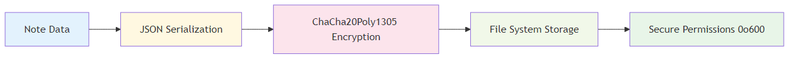
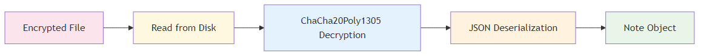

# Procedure and steps

## Testing with `egui`

After reading up on a bit of the documentation, I tried to copy a simple "tutorial" app that is just a input field for a name and a slider for the age. Once I was done copying all the code and successfully ran the program for the first time, I tried to figure out how I can access variables that I referenced when initiating the app's components. I also played around with function calls, and where it is best to place them.

## Encrypting and saving

During my experiments with `egui` and other crates that I'd use later in the project, I initially went for an approach that encrypts the notes in an unusual way:

1. Key Derivation:
    A random 16-byte salt is generated. Using Argon2id, a secure 32-byte key is derived from the user's password and the salt.
2. Encryption:
    A random 12-byte nonce is created. The plaintext data is encrypted using AES-256-GCM with the derived key and nonce, producing ciphertext and an authentication tag.
3. Metadata Attachment
    The salt, Argon2 password hash (as UTF-8), nonce, and ciphertext are bundled together along with structured metadata (e.g., as a JSON `EncryptedData` object).
4. Obfuscation and Finalization
   - A fake 'SQLite format 3' header is prepended.
   - A Unix timestamp (8 bytes) and 48 bytes of random padding are appended.
   - A SHA-256 checksum of the entire content is added for integrity.

In the actual project, the encryption process looks a little more like this:

### Hardware Fingerprinting

The system creates a stable hardware fingerprint using:

```rust
// Components used for hardware fingerprinting
let mut components = Vec::new();
components.push(format!("user:{}", username));           // Username
components.push(format!("home:{}", home_dir));           // Home directory
components.push(format!("os:{}", env::consts::OS));      // Operating system
components.push(format!("arch:{}", env::consts::ARCH));  // Architecture
components.push(format!("computer:{}", computer_name));  // Computer name
```

### Password-Based Key Derivation (Argon2id)

```rust
// Production-grade Argon2 parameters
let memory_cost = 131072;  // 128 MB memory usage
let iterations = 3;        // 3 iterations
let parallelism = 4;       // 4 parallel threads

// Key derivation takes ~5-10 seconds intentionally
let params = argon2::Params::new(memory_cost, iterations, parallelism, Some(32));
let argon2 = Argon2::new(argon2::Algorithm::Argon2id, argon2::Version::V0x13, params);
```

### Hardware-Bound Salt Generation

```rust
fn generate_hardware_salt(&self) -> [u8; 32] {
    let hardware_hash = self.generate_stable_hardware_fingerprint();
    let hash_bytes = hardware_hash.to_le_bytes();

    // Create deterministic salt from hardware fingerprint
    for i in 0..32 {
        let factor = (i as u8).wrapping_mul(17);
        salt[i] = hash_bytes[i % 8] ^ factor ^ 0xAA;
    }
}
```

### Encryption Implementation

#### Cipher: ChaCha20Poly1305 AEAD

- **Algorithm**: ChaCha20 stream cipher + Poly1305 MAC
- **Key Size**: 256 bits (32 bytes)
- **Nonce Size**: 96 bits (12 bytes)
- **Authentication**: Built-in message authentication

#### Encryption Process

```rust
pub fn encrypt(&self, data: &[u8]) -> Result<Vec<u8>> {
    let cipher = self.cipher.as_ref().ok_or("Cipher not initialized")?;

    // Generate random nonce for each encryption
    let nonce = ChaCha20Poly1305::generate_nonce(&mut OsRng);

    // Encrypt data with authentication
    let ciphertext = cipher.encrypt(&nonce, data)?;

    // Prepend nonce to ciphertext
    let mut result = Vec::new();
    result.extend_from_slice(&nonce);      // First 12 bytes: nonce
    result.extend_from_slice(&ciphertext); // Remaining: encrypted data + auth tag
    Ok(result)
}
```

#### Decryption Process

```rust
pub fn decrypt(&self, data: &[u8]) -> Result<Vec<u8>> {
    if data.len() < 12 {
        return Err(anyhow!("Invalid encrypted data"));
    }

    // Split nonce and ciphertext
    let (nonce_bytes, ciphertext) = data.split_at(12);
    let nonce = Nonce::from_slice(nonce_bytes);

    // Decrypt and verify authentication
    let plaintext = cipher.decrypt(nonce, ciphertext)?;
    Ok(plaintext)
}
```

### Data Flow

#### Authentication & Key Initialization Process


#### Note Storage Process



#### Note Retrieval Process



### Security Features

#### Hardware Binding

```rust
// Security check on each login
let (current_hash, current_components) = self.generate_stable_hardware_fingerprint()?;

if metadata.hardware_fingerprint_hash != current_hash {
    // Detect hardware changes
    return Err(anyhow!("Hardware fingerprint changed"));
}
```

#### Security Metadata

```rust
struct SecurityMetadata {
    version: u32,                           // Encryption version
    created_timestamp: u64,                 // Account creation time
    hardware_fingerprint_hash: u64,         // Hardware binding hash
    hardware_components: Vec<String>,       // Detailed hardware info
}
```

#### File Security

```rust
#[cfg(unix)]
fn secure_file_permissions(&self, file_path: &Path) -> Result<()> {
    let mut perms = fs::metadata(file_path)?.permissions();
    perms.set_mode(0o600); // Owner read/write only
    fs::set_permissions(file_path, perms)?;
}
```

#### User Isolation

```plaintext
~/.config/secure_notes/
├── users.json                    # User database (hashed passwords)
└── users/
    ├── user1-uuid/
    │   ├── notes.enc             # Encrypted notes
    │   ├── auth.hash             # Password verification hash
    │   └── security.meta         # Security metadata
    └── user2-uuid/
        ├── notes.enc
        ├── auth.hash
        └── security.meta
```

### Security Properties

| Property             | Implementation               | Benefit                           |
| -------------------- | ---------------------------- | --------------------------------- |
| **Confidentiality**  | ChaCha20 encryption          | Data unreadable without key       |
| **Integrity**        | Poly1305 authentication      | Detects tampering                 |
| **Authentication**   | Argon2 password hashing      | Prevents unauthorized access      |
| **Hardware Binding** | Fingerprint-based salt       | Prevents key extraction           |
| **Forward Secrecy**  | Random nonces per encryption | Past data safe if key compromised |
| **User Isolation**   | Per-user encryption keys     | No cross-user data access         |

### Key Security Parameters

```rust
// Argon2id Configuration (Production Grade)
memory_cost: 131072,    // 128 MB - Prevents memory-hard attacks
iterations: 3,          // 3 rounds - Balances security/performance
parallelism: 4,         // 4 threads - Utilizes modern CPUs
output_length: 32,      // 256-bit key - Industry standard

// ChaCha20Poly1305 Configuration
key_size: 32,          // 256-bit key
nonce_size: 12,        // 96-bit nonce (never reused)
auth_tag_size: 16,     // 128-bit authentication tag
```

### Critical Security Checks

#### Hardware Change Detection

```rust
fn is_critical_hardware_change(&self, stored: &[String], current: &[String]) -> bool {
    // Only fail on critical component changes
    let stored_critical: Vec<_> = stored.iter()
        .filter(|c| c.starts_with("user:") || c.starts_with("os:") || c.starts_with("arch:"))
        .collect();

    let current_critical: Vec<_> = current.iter()
        .filter(|c| c.starts_with("user:") || c.starts_with("os:") || c.starts_with("arch:"))
        .collect();

    stored_critical != current_critical
}
```

This encryption system provides **military-grade security** while maintaining usability through automatic key management and hardware binding, ensuring that encrypted notes remain secure even if the application files are compromised.
